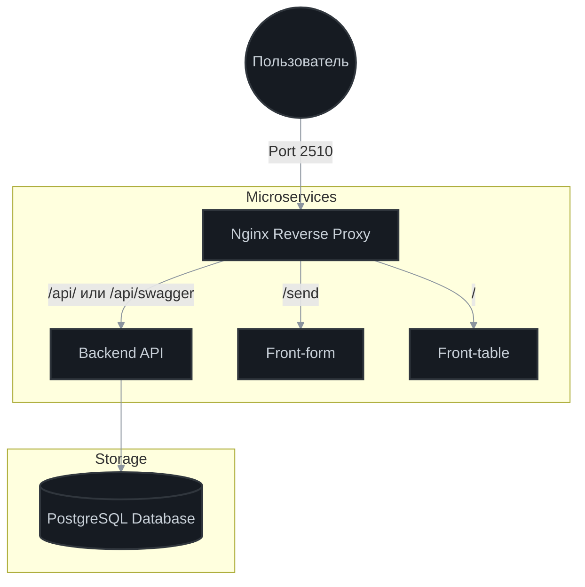

# 🌟 Feedback Pulse System


## Обзор проекта (Overview)

**Feedback Pulse System** — это комплексная микросервисная экосистема для сбора, обработки и визуализации обратной связи. Система спроектирована как **мета-репозиторий**, объединяющий три независимых сервиса, что позволяет гибко управлять разработкой и масштабированием каждого компонента в отдельности.

## Структура репозитория (Repository Structure)

Проект использует Git Submodules. Ссылки ниже ведут в соответствующие подрепозитории:

- 📂 **backend-go** — Серверная часть (Go + Gin) [**Open on GitHub**](https://github.com/ddanyo/backend-feedback-go)

- 📂 **frontend-form** — Клиентская часть для сбора фидбека (Vite + TS) [**Open on GitHub**](https://github.com/ddanyo/frontend-feedback-form)

- 📂 **frontend-table** — Панель визуализации данных (Vite + TS + React) [**Open on GitHub**](https://github.com/ddanyo/frontend-feedback-table)
- 📄 `docker-compose.yml` — Конфигурация для оркестрации всей системы.

## Архитектурная философия (Architecture & Philosophy)

Проект построен на принципах **полной изоляции** и **production-ready** подхода:

- **Независимость:** _backend_, _frontend-form_ и _frontend-table_ являются абсолютно самодостаточными проектами. Каждый из них имеет собственный жизненный цикл, зависимости (`package.json`), Docker-конфигурации и может быть склонирован в отдельную директорию для изолированной работы.
- **Мета-репозиторий:** Данный корень проекта служит "единой точкой входа" (Umbrella repository). Он связывает сервисы через **Git Submodules**.
- **Удобство для ревью:** Общий `docker-compose.yml` в корне создан исключительно для того, чтобы менторы или разработчики могли поднять всю инфраструктуру одной командой, не тратя время на настройку каждого сервиса по отдельности.

## Инженерный стенд / Особенности фронтенда (Tech Showcase)

- **Управление состоянием (State Management):**
  - _Server-side fetching_: Классическая пагинация с запросами к API на каждую страницу.
- **Методы отображения:**
  - _Classic Pagination_: Традиционное разбиение на страницы.
  - _Infinite Scroll_: Динамическая подгрузка данных при скролле.

## Схема Архитектуры (Architecture Diagram)



## База данных и Тестовые данные (Database & Seeding)

В проекте используется **PostgreSQL**. Для подключения к бд в docker-контейнере наружу прокинут порт `5433` (чтобы исключить конфликты со стандартным `5432`). Для быстрого старта и тестирования производительности в папке `backend/test-data/` подготовлен файл `dump.sql`.

- **Автоматизация**: При первом запуске Docker-контейнера база данных автоматически подхватывает дамп и выполняет инициализацию. Ручное наполнение не требуется.

## 🚀 Запуск проекта (Running the Application)

Вы можете запустить систему двумя способами: через общий `docker-compose` (идеально для демонстрации всей системы целиком) или независимо в рамках каждого микросервиса (для разработки и отладки отдельных модулей).
Требуется наличие docker на хост-машине.

### 1 Способ: Быстрый запуск всей системы (Unified Launch)

Общий `docker-compose.yml` в корне мета-репозитория автоматически поднимет всю инфраструктуру. Все зависимости будут установлены **внутри контейнеров** при их сборке, поэтому установка Node.js на хост-машине не требуется.

**1. Клонируем репозиторий вместе со всеми подмодулями**

```bash
git clone --recurse-submodules https://github.com/ddanyo/feedback-platform.git
```

⚠️ Если вы уже склонировали репозиторий без флага `--recurse-submodules` и видите пустые папки проектов, выполните:

```bash
git submodule update --init --recursive
```

**2. Переходим в корень проекта**

```bash
cd feedback-platform
```

**3. Настраиваем переменные окружения. В корне репозитория находится файл `.env.example`. Нужно создать файл `.env` на основе примера**

```bash
cp .env.example .env
```

⚠️ После этого откройте созданный файл `.env` любым редактором и проставьте актуальные значения (_имя для бд_, _пароль_).

**4. Собираем и запускаем всю систему в Docker**

```bash
docker compose up -d --build
```

Далее, после первого билда, можно управлять запуском через `docker compose up/down`

✅ Что вы должны получить в выводе после `docker compose up -d --build`:

```bash
 ✔ Image postgres:17-alpine            Pulled
 ✔ Image nginx:alpine                  Pulled
 ✔ Image feedback-platform-front-table Built
 ✔ Image feedback-platform-backend     Built
 ✔ Image feedback-platform-front-form  Built
 ✔ Container fs-table                  Started
 ✔ Container fs-postgres               Healthy
 ✔ Container fs-form                   Started
 ✔ Container fs-backend-go             Started
 ✔ Container fs-proxy                  Started
```

### 2 Способ: Изолированная разработка (Independent Launch)

Этот способ предназначен для ведения локальной разработки проекта. Здесь зависимости устанавливаются **на вашей хост-машине**, чтобы редактор кода (VS Code) мог корректно подсвечивать типы TypeScript и предоставлять автодополнение.

**1. Клонируем проект**

```bash
git clone --recurse-submodules https://github.com/ddanyo/feedback-platform.git
```

⚠️ Если вы уже склонировали репозиторий без флага `--recurse-submodules` и видите пустые папки проектов, выполните:

```bash
git submodule update --init --recursive
```

**2. Переходим в корень проекта**

```bash
cd feedback-platform
```

**3. Устанавливаем зависимости в нужном сервисе (или во всех).**

Используем `npm ci`, чтобы гарантировать идентичность версий из lock-файлов

```bash
cd frontend-form && npm ci
```

```bash
cd frontend-table && npm ci
```

**4. Настраиваем микросервис `backend-go`**

Для данного микросервиса нужно настроить `.env`, как в предыдущем способе запуска

```bash
cd backend-go && cp .env.example .env
```

**5. Запуск сервисов**

```bash
cd backend-go && docker compose up -d --build
```

```bash
cd frontend-form && docker compose up -d --build
```

```bash
cd frontend-table && docker compose up -d --build
```

_(При работе над одним сервисом остальные части системы могут быть запущены в фоновом режиме через общий docker-compose, а нужный вам сервис — пересобран отдельно для применения ваших изменений)._

## 🔌 Маршрутизация и Порты (Endpoints & URLs)

Вся система доступна на одном порту **2510** благодаря прокси-серверу (Nginx), который физически запускается внутри контейнера Backend-сервиса, обеспечивая единую точку входа.

| Компонент          | Путь (URL)                                                             | Описание                              |
| :----------------- | :--------------------------------------------------------------------- | :------------------------------------ |
| **Frontend Table** | [http://localhost:2510/](http://localhost:2510/)                       | Главная страница - таблица с отзывами |
| **Frontend Form**  | [http://localhost:2510/send](http://localhost:2510/send)               | Форма отправки обратной связи         |
| **Backend API**    | [http://localhost:2510/api](http://localhost:2510/api)                 | Точка входа для API запросов          |
| **Swagger UI**     | [http://localhost:2510/api/swagger](http://localhost:2510/api/swagger) | Документация методов API              |

## 🛠️ Памятка разработчику (Development Workflow)

При работе с Git Submodules помните о правиле "двойного коммита":

1.  Сначала сделайте коммит и пуш внутри папки конкретного сервиса (например, `frontend-table`).
2.  Затем сделайте коммит в корневом репозитории, чтобы обновить указатель на новую версию подмодуля.

Обновление всех подмодулей до последних версий из удалённого репозитория:

```bash
git submodule update --remote
```

## Автор (Author)

**Даниил Кондратюк**  
_Fullstack Developer / Software Engineer_

- **GitHub:** [@ddanyo](https://github.com/ddanyo)
- **Telegram:** [@ddanyo](https://t.me/ddanyo)
- **Habr Career:** [@ddanyo](https://career.habr.com/ddanyo)

---

_Проект создан в рамках образовательной стажировки по архитектуре микросервисов._
